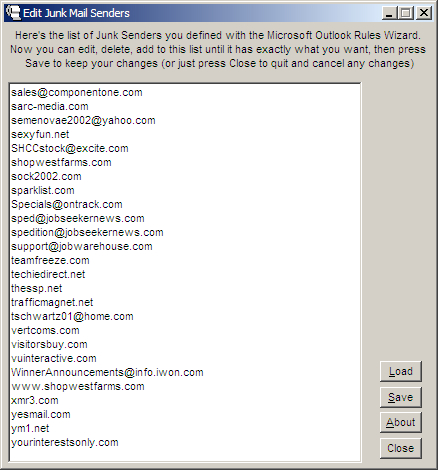



## Edit Outlook Junk Mail Senders

### Description

A simple project that lets you display, edit, add and delete entries in your Microsoft Outlook "Junk Senders" list. If you've used the Outlook Rules Wizard to create a list of Junk Senders, this gives you a more flexible interface to maintain them.

The neat thing is that this all fits easily into the code behind one very basic form.
 
### More Info
 
Tested on a couple of PCs here running Windows 2000 and Windows XP, with Microsoft Office 2000 and Office XP. If your system has different versions or an unusual configuration, I have no idea if this will work!

None that I know of

             |
---                |---
**Submitted On**   |2002-02-20 20:59:18
**By**             |[Brian Battles WS1O](https://github.com/Planet-Source-Code/PSCIndex/blob/master/ByAuthor/brian-battles-ws1o.md)
**Level**          |Beginner
**User Rating**    |4.9 (64 globes from 13 users)
**Compatibility**  |VB 6\.0
**Category**       |[Microsoft Office Apps/VBA](https://github.com/Planet-Source-Code/PSCIndex/blob/master/ByCategory/microsoft-office-apps-vba__1-42.md)
**World**          |[Visual Basic](https://github.com/Planet-Source-Code/PSCIndex/blob/master/ByWorld/visual-basic.md)
**Archive File**   |[Edit\_Outlo565562202002\.zip](https://github.com/Planet-Source-Code/brian-battles-ws1o-edit-outlook-junk-mail-senders__1-31989/archive/master.zip)

### API Declarations

Just one simple API call to get your default AppData path and user name, see the code

